# Canteen Frontend

## Overview
The **Canteen Application** is a Flutter-based frontend designed to streamline the food ordering process. It allows users to browse and order food items, track their purchases, and view receipts, while canteen staff can efficiently manage orders, inventory, and featured menu items.

This project has been an invaluable learning experience, as it marks my first integration of an **ASP.NET backend** with Flutter. It serves as a **proposal for my host company**, demonstrating how a digital ordering system can enhance efficiency and improve the overall canteen experience.

**Note:** This project is still in development, and features may be buggy or not work properly as improvements are still being made.

## Features
- **User-Friendly Interface** – Browse menu items, track orders, view receipts for completed purchases, and see featured items.
- **Seamless Order Management** – Place orders and track their real-time status.
- **Canteen Staff Dashboard** – Manage orders efficiently, update stock levels, and highlight featured items for employees.
- **Admin Staff Dashboard** - View removed items, and manage roles for all users.
- **Cross-Platform Compatibility** – Optimized for both mobile and desktop, ensuring accessibility across devices.

## Technologies Used
- **Flutter** – Frontend framework for building a modern UI.
- **Supabase** – Backend-as-a-Service for database management.
- **Dart** – Programming language for Flutter development.
- **ASP.NET** – Backend API framework, connected to an **SQL database** on Azure Data Studio.

## Screenshots

### User Experience
| Landing Page | Login Page | Registration Page |
|:---:|:---:|:---:|
| 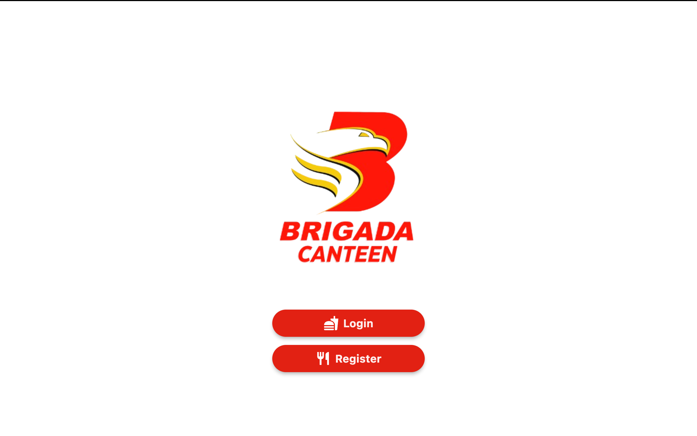 | 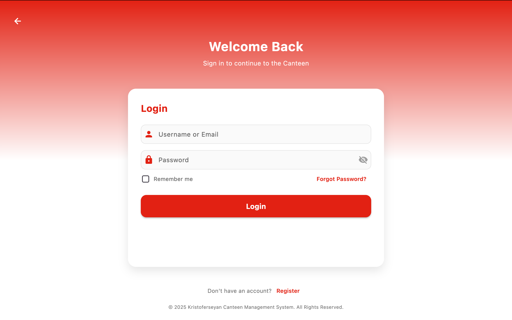 | 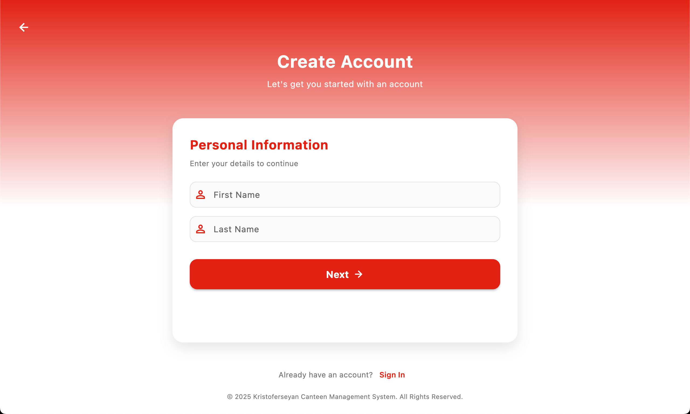 |

### Employee Features
| Dashboard | Menu | Orders | Confirm Order |
|:---:|:---:|:---:|:---:|
| 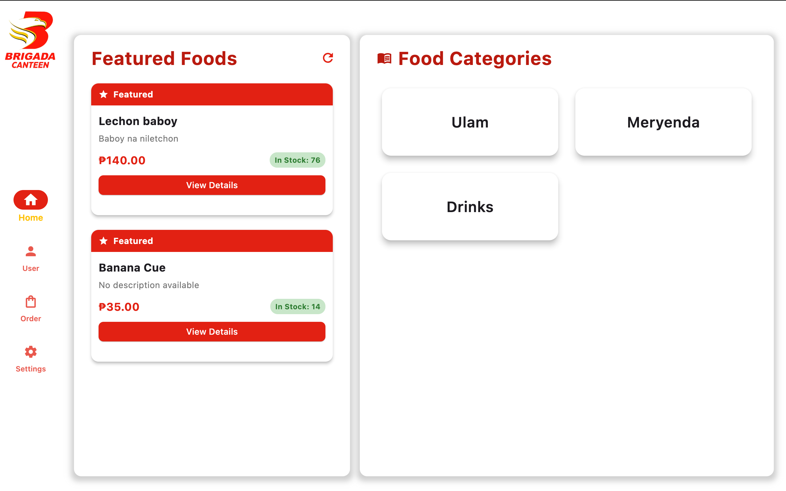 | 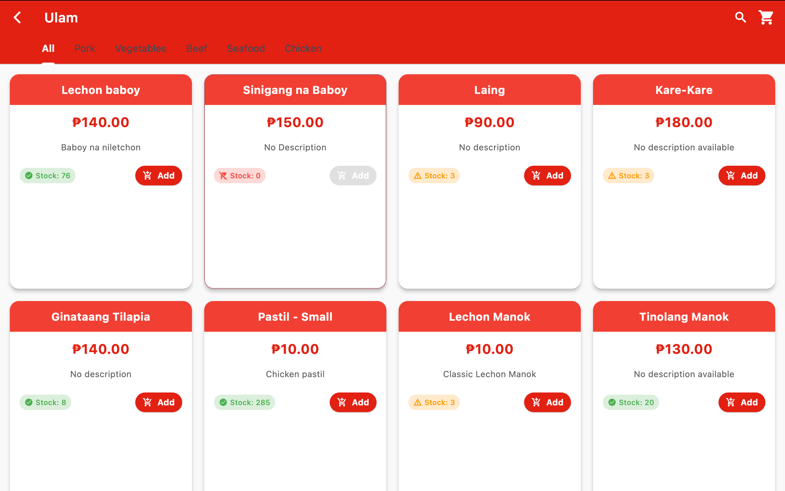 | 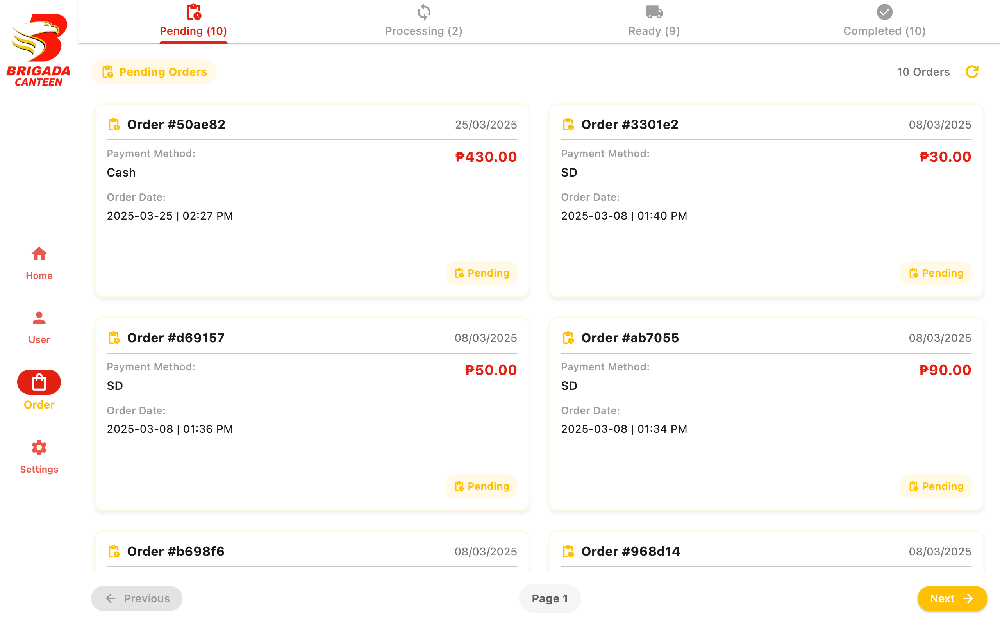 | 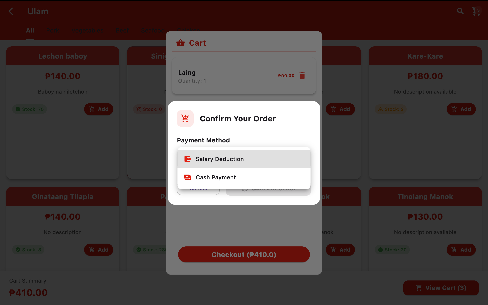 |

### Staff Features
| Dashboard | Stock Management | Completed Orders | User Payments |
|:---:|:---:|:---:|:---:|
| 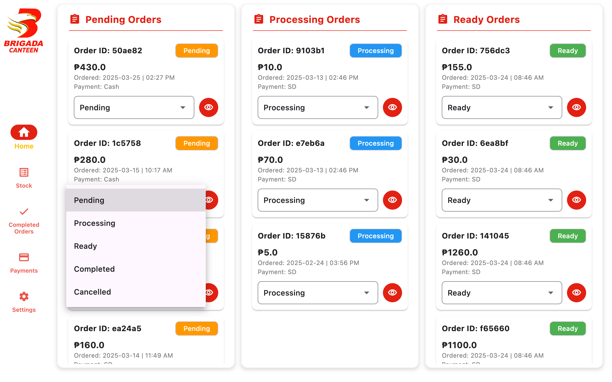 | 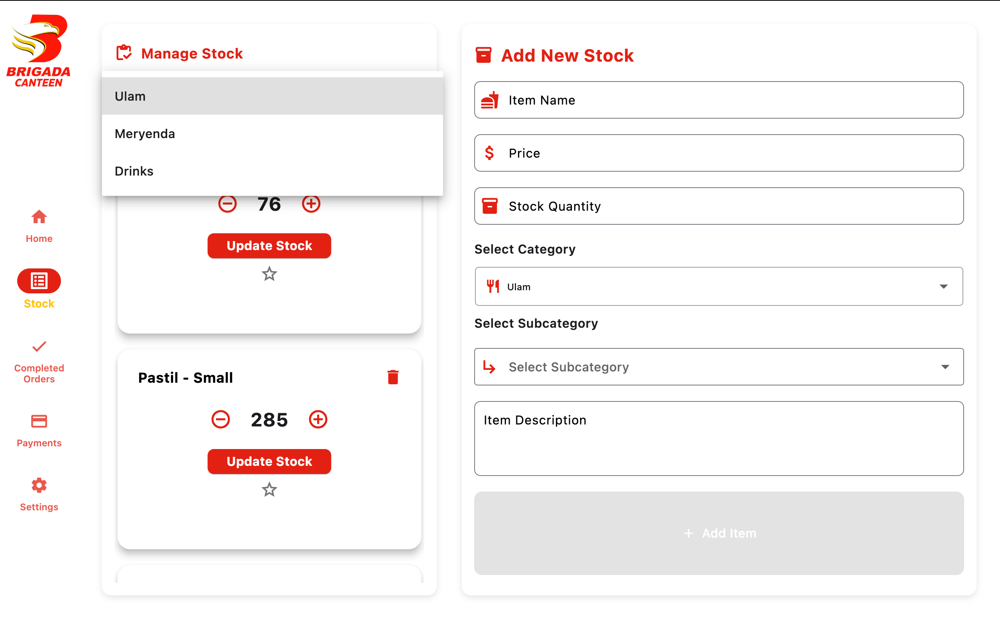 | 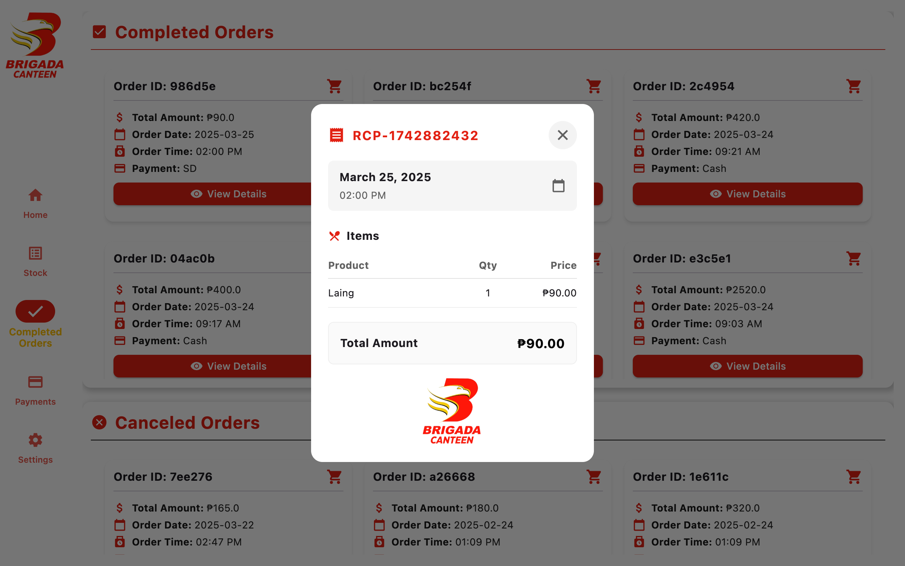 | 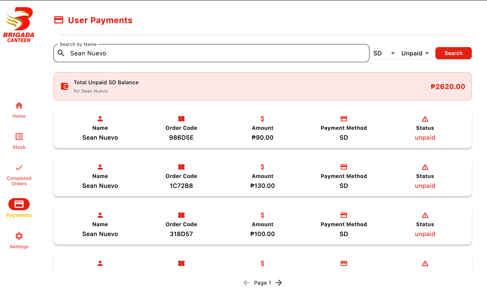 |

## License
This project is licensed under the **MIT License**.